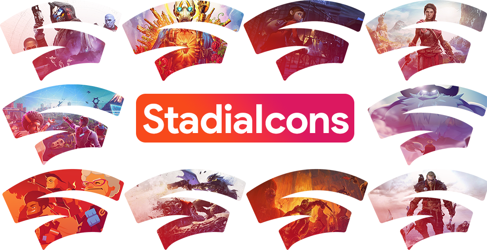

# StadiaIcons
Icon Designs for Stadia Games.

## What is it?
StadiaIcons a set of game icons designed with Google Stadia in mind ([stadia.com](https://stadia.com)). The objective is to have one logo for each game in the Google Stadia Library, following a simple design principle inspired by the Stadia logo and colors.

## How can I use it?
StadiaIcons can be used in one of 2 ways:
1. You can simply download or use a link to the icons you wish to use in [PNG image format](/Images), as [Windows Icons](/Icons), or as [WebP Images](/WebP); you are free to use them as you see fit!
2. You can use [StadiaIcons Shortcuts](https://stadiaicons.web.app/), which lets you install shortcuts to individual Stadia games directly to your Desktop (and Start Menu in Windows) with the corresponding StadiaIcons icon automatically assigned. Learn more in the [Shortcuts](/Shortcuts) folder.

### Developers
#### StadiaIcons
The [refs.json](refs.json) file contains a list of all StadiaIcons referenced by game uid (the ones used in Stadia game URLs). Image paths can be constructed using the information contained in the `datasets` coupled with individual `uids`.

Each image uri can be constructed as follows: `datasets.X.uri` + `uids.Y.Z` + (optional)`other.altSuffix` + `datasets.X.extension` where `X` is the type of icon, `Y` is the game uid and `Z` is the icon variant id (`0` by default).

#### StadiaIcons Shortcuts
If you wish to make use of the [StadiaIcons Shortcuts](https://stadiaicons.web.app/) system, you will find the relevant information and code in the [/Shortcuts](/Shortcuts) folder.

## Contents
Each game logo comes in 2 styles with 2 color variants each.

The default icons are designed to be displayed in larger sizes (>128px)? They take the shape of the full Stadia Logo.

 

The smaller variants are designed to be easily identifiable when displayed at smaller sizes, such as Windows Start Menu icons.

 

The images with a tinted overlay are the default; they are designed to make the logos fit with the Stadia color scheme.

The versions with only the game's default image colors follow the same naming scheme with an added `_alt` at the end of the filename.

***Note:** For some games, additional icons are available based on the game's promotional material.*
